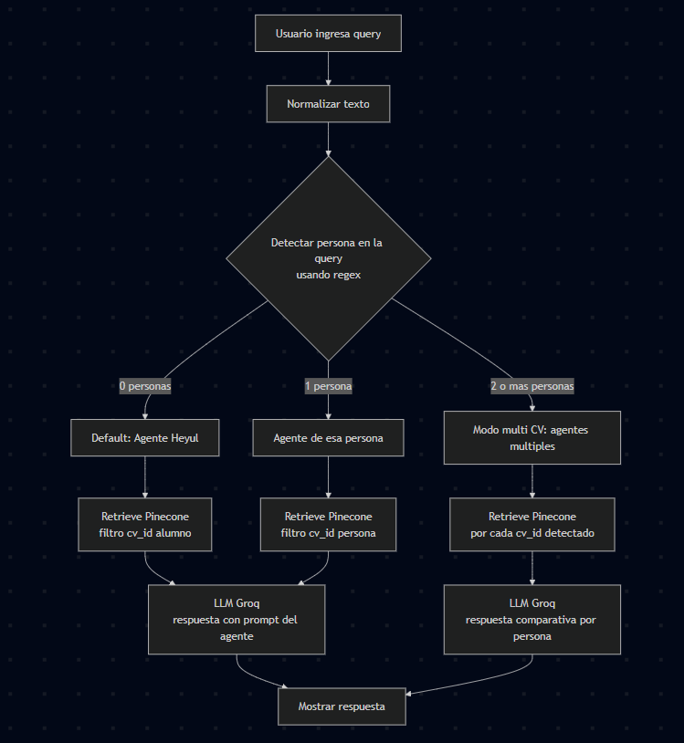
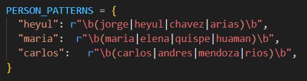
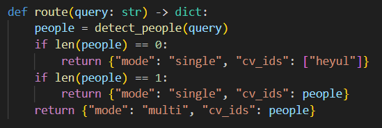
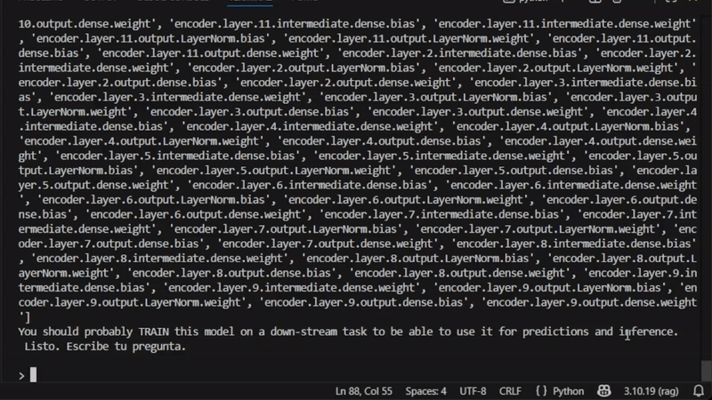

# RAG Multi-CV con Router por Agentes

Trabajo Practico 3.

Maestrías en Inteligencia Artificial. \
Universidad de Buenos Aires. Laboratorio de Sistemas Embebidos.\
Curso: Procesamiento de Lenguaje Natural 2.\
Alumno: Jorge Heyul Chavez Arias\
Profesor: Mg. Ing. Ezequiel Guinsburg, Abraham Rodriguez.
##


### Objetivo del trabajo

Implementar un sistema de Retrieval-Augmented Generation (RAG) que sea capaz de responder consultas dependiendo de la persona mencionada en la query, utilizando:

- Un agente por persona (1 CV = 1 agente).
- Un agente por defecto (heyul) cuando no se menciona ninguna persona.
- Modo multi-CV cuando se consulta por más de una persona.

El sistema debe decidir dinámicamente qué agente(s) utilizar y recuperar el contexto adecuado desde una base vectorial.

Implementación del Trabajo Práctico 3:
- Router con conditional edge (regex) para detectar persona(s) en la query
- 1 agente por persona (heyul / maria / carlos).
- Default agent cuando no se menciona persona.
- Modo multi-CV: retrieve por cada cv_id y respuesta por persona.

## Diagrama de flujo del sistema

El sistema sigue el flujo mostrado en el siguiente diagrama:


## Explicación de cada etapa del diagrama
### 1. Ingreso de la query

El usuario ingresa una pregunta en lenguaje natural, por ejemplo:

- “¿Cuántas patentes tiene Heyul?”.
- “Compara a Heyul y Carlos en experiencia de proyectos”.
- “¿Cuál es el ORCID?” (sin mencionar persona).

### 2. Normalización del texto

Antes de analizar la query, esta se normaliza para evitar errores de detección:

- Conversión a minúsculas.
- Eliminación de tildes.
- Eliminación de signos de puntuación.

Esto permite que expresiones como "Heyúl", "HEYUL" o "Heyul", sean normalizados a "heyul" y puedan ser detectados correctamente.

### 3. Conditional Edge – detección de personas (router)

El archivo `router.py` implementa la lógica de decisión del sistema.

Se utilizan expresiones regulares (regex) para detectar nombres o apellidos asociados a cada CV, en este caso son 3 (heyul, maria y carlos):




La función route(query) devuelve:

- 0 personas detectadas → agente por defecto (heyul).
- 1 persona detectada → agente de esa persona.
- 2 o más personas detectadas → modo multi-CV.




### 4. Selección del agente

Cada persona tiene asociado un agente lógico, definido por:

- Un `cv_id`.
- Un prompt de sistema específico.
- Un contexto recuperado únicamente desde su CV.

Ejemplos:
- `AGENTE_HEYUL`
- `AGENTE_MARIA`
- `AGENTE_CARLOS`

En modo multi-CV, se activa un agente por cada persona detectada, y el LLM responde comparando o separando la información por individuo.

### 5. Retrieval (RAG con Pinecone)

Una vez definido el/los agente(s):

- Se genera un embedding de la query.
- Se consulta Pinecone filtrando por `cv_id`.
- Se recuperan los chunks más relevantes del CV correspondiente.

Esto garantiza que:
- Un agente nunca accede a información de otro CV.
- El contexto es preciso y controlado.

### 6. Generación de la respuesta (LLM)

El contexto recuperado se pasa al modelo LLM (Groq – LLaMA), junto con un prompt que indica:

- Responder solo usando el contexto
- Ser conciso
- Responder por persona en modo multi-CV

El resultado es una respuesta final clara y alineada a la pregunta original.

## Importancia de la nueva estructura de los CV

Los CV fueron reestructurados previamente para mejorar el funcionamiento del RAG.
Esto permitió:

- Chunks más coherentes semánticamente
- Mejor recuperación de información específica (patentes, ORCID, proyectos, etc.)
- Menor cantidad de chunks irrelevantes

Gracias a esta estructura, el sistema:

- Usa menos chunks
- Consume menos memoria
- Recupera información más precisa

La lógica final del sistema se beneficia directamente de esta mejora estructural.

## Proceso de indexación – `subir_cv.py`

El archivo `subir_cv.py` se encarga de preparar los CV para el sistema RAG.

Pasos del proceso:

- Lectura del archivo CV (.txt)
- Normalización del texto
- Segmentación en chunks
- Generación de embeddings
  - Modelo: jinaai/jina-embeddings-v2-base-es
  - Optimizado para español
- Inserción en Pinecone
- Cada chunk incluye metadata:
  - cv_id
  - chunk_index
  - text

Esto permite luego filtrar de forma precisa durante el retrieval.

## Conclusión

El sistema implementado incorpora:

- Decisión dinámica mediante Conditional Edge.
- Agentes especializados por persona.
- Modo multi-CV.
- RAG con vector store.
- Uso de regex para control del flujo.

La correcta estructuración de los CV y la lógica de agentes permiten obtener respuestas precisas, escalables y fácilmente extensibles a nuevos perfiles.
 
## Estructura del proyecto

```text
├─ README.md
├─ requirements.txt
├─ .env.example
├─ cv_heyul.txt
├─ cv_carlos.txt
├─ cv_maria.txt
├─ subir_cv.py          
├─ router.py      
└─ consultar.py              
```

## Ejemplo del chatbot:



Preguntas realizadas:

### Busca agente:
> cual es el H-index de Heyul? 

[ROUTE] single -> heyul\
El H-Index de Heyul es 3, según su perfil profesional y la información proporcionada en su CV, específicamente en la sección de "INFORMACIÓN PERSONAL" donde se menciona su identificador Scopus y su H-Index.

### Busca agente:
> que especialidad tiene maria?

[ROUTE] single -> maria\
La especialidad de María es Ciencia de Datos y Analítica Educativa, con énfasis en Machine Learning y Estadística Aplicada. También se especializa en áreas transversales como Evaluación educativa y Políticas públicas en educación.

### Busca agente:
> dame un breve resumen de carlos

[ROUTE] single -> carlos\
Carlos Andrés Mendoza Ríos es un ingeniero e investigador especializado en robótica móvil, sistemas autónomos y control inteligente. Tiene experiencia en el desarrollo de robots terrestres y aéreos para inspección, agricultura y minería, y ha trabajado en proyectos de integración de sensores, control autónomo y simulación en entornos reales y virtuales utilizando ROS, Gazebo y sistemas embebidos. Es doctor en Ingeniería Eléctrica y magíster en Automatización y Robótica, y cuenta con una producción científica de 12 artículos indexados. Actualmente se desempeña como Investigador Principal en Robótica en el Centro de Innovación en Robótica en Chile.

### Busca agente:
> que experiencia tiene maria en propiedad intelectual?

[ROUTE] single -> maria\
No hay información disponible en el CV de María sobre experiencia en propiedad intelectual.

### Default agente:
> que experiencia tiene en propiedad intelectual?

[ROUTE] single -> heyul\
Según el CV de Heyul, su experiencia en propiedad intelectual se refleja en:

* Formulación, solicitud y registro de patentes tecnológicas ante INDECOPI y PCT como Asistente de Investigación en la Universidad Peruana de Ciencias Aplicadas (UPC).
* Redacción de patentes, mencionada como una de sus áreas de especialización.
* Ha registrado o solicitado un total de 25 patentes en áreas como dispositivos médicos, diagnóstico respiratorio, espirometría digital, agricultura inteligente, sistemas electrónicos industriales y visión.
* Ha participado en cursos y capacitaciones relacionados con propiedad intelectual, como "Propiedad Intelectual y Redacción de Patentes — INDECOPI".

En resumen, Heyul tiene experiencia en la gestión de propiedad intelectual a través de la redacción y registro de patentes, así como en la participación en proyectos de investigación y desarrollo que involucran la creación de tecnologías innovadoras.

### Default agente:
> en que proyectos vinculados a salud trabajó?

[ROUTE] single -> heyul\
Según el CV de Heyul, algunos de los proyectos vinculados a salud en los que ha trabajado son:

1. Dispositivo portátil de medición no invasiva de hemoglobina (Exp. 3123-2024)
2. Personal digital spirometer for respiratory disease control (Exp. 001939-2020/DIN)
3. Equipo electrónico para estimación del tiempo de hospitalización COVID-19 (PCT/CL2021/050128)


Además, ha trabajado en proyectos relacionados con dispositivos biomédicos, diagnóstico respiratorio, espirometría digital y salud digital. También ha colaboradAdemás, ha trabajado en proyectos relacionados con dispositivos biomédicos, diagnóstico respiratorio, espirometría digital y salud digital. También ha colaborado en redes internacionales de innovación y ha sido becario del programa Leadership in Innovation Fellowships (LIF) de la Royal Academy of Engineering (Reino Unio en redes internacionales de innovación y ha sido becario del programa Leadership in Innovation Fellowships (LIF) de la Royal Academy of Engineering (Reino Unido).
do).

### Multi agente:
> maria y carlos tienen maestria?

[ROUTE] multi -> ['maria', 'carlos']\
Sí, tanto María como Carlos tienen maestría.

María tiene una Maestría en Estadística Aplicada de la Universidad Nacional de Ingeniería en Perú.

Carlos tiene una Maestría en Automatización y Robótica de la Universidad Técnica Federico Santa María en Chile.

